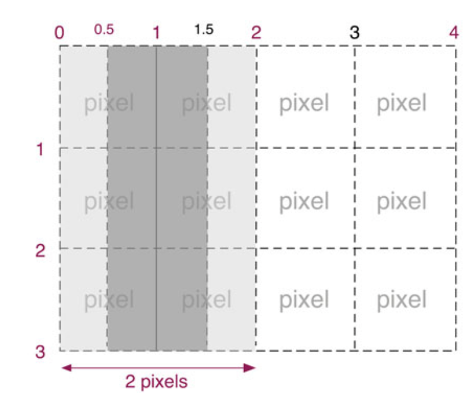
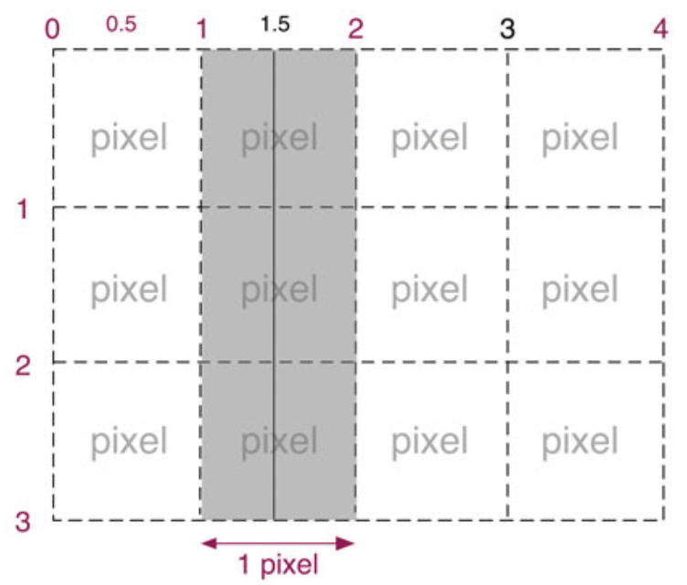
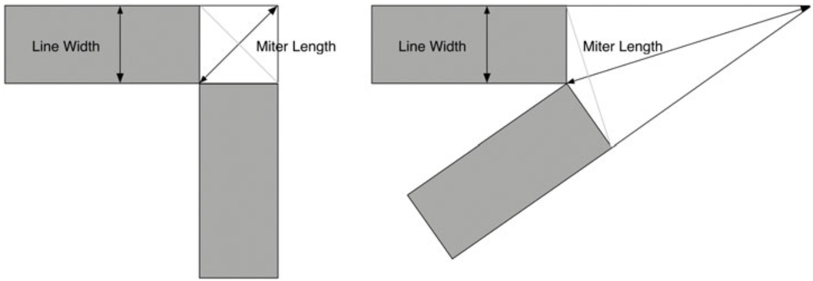

<script setup>
import { 
    SimpleRect, 
    ColorOpacityDemo,
    LineGradientDemo,
    RadialGradientDemo,
    ConicGradientDemo,
    ImageFillPattern,
    ButtonShadow,
    StrokeFillDemo,
    CutoutTwoCircle,
    MultiCutout,
    SimpleLine,
    OnePixelGrid,
    CoordinateAxis,
    RudderLineDrawer,
    OldDashedLine,
    NewDashedLine,
    LineCapDemo,
    LineJoinDemo,
    RudderCircleDrawer,
    RoundCornerRect,
    DialDemo,
    CheckedMark,
    RoundTriangle,
    CubicBezierDemo,
    RegularPolygonDrawer,
    BezierDrawer,
    OriginTranslate,
    PolygonEditor,
    RotateScaleTranslate,
    MirrorTriangle,
    TranslateVsTransform,
    ScaleVsTransform,
    RotateVsTransform,
    TransformWork,
    SpinningDemo,
    CompositeOperationDemo,
    SpotLightDemo,
    ClipSimpleDemo,
    EraserDemo,
} from './codes/02';
</script>

# 02. 绘制

## 坐标系统

默认情况下，Canvas 的坐标系统以 canvas 的左上角为原点，X 坐标向右增长，Y 坐标向下增长。

然而 Canvas 的坐标系并不是固定的。可以对坐标系进行变换，下面是坐标变换的类型：

- 平移 (translate)
- 旋转 (rotate)
- 缩放 (scale)
- 自定义变换方式，例如切变

坐标系统的变换是 Canvas 中一项非常基础的功能，它在很多不同的场合都很有用。例如，将坐标系统平移，可以极大简化在对图形及文本进行绘制与填充时所需的数值计算。

## Canvas 的绘制模型

在向 canvas 上绘制图形或图像时，浏览器按照如下步骤来操作：

1. 将图形或图像绘制到一个无限大的透明位图中，在绘制时遵从当前的填充模式、描边模式以及线条样式；
2. 将图形或图像的阴影绘制到了另一幅位图中，在绘制时使用当前绘图环境的阴影设置
3. 将阴影中的每个像素的 alpha 分量乘以绘图环境对象的 globalAlpha 属性值
4. 将绘有阴影的位图与结果剪辑区域剪切过的 canvas 进行图像合成。在操作时使用当前的合成模式参数
5. 将图形或图像的每个像素颜色分量，乘以绘图环境对象的 globalAlpha 属性值
6. 将绘有图形或图像的位图，合成到当前经过剪辑区域剪切过的 canvas 位图之上，在操作时使用当前的合成操作符（composition operator）

## 矩形绘制

Canvas 的 API 提供了如下三个方法：

- 矩形区域清除: `clearRect(x: number, y: number, w: number, h: number)`
- 矩形描边: `strokeRect(x: number, y: number, w: number, h: number)`
- 矩形填充: `fillRect(x: number, y: number, w: number, h: number)`

下面是一个简单应用，使用了上述三个方法：

<SimpleRect />

该应用使用 `strokeRect()` 绘制左侧矩形，使用 `fillRect()` 绘制右侧矩形。用户在 canvas 内任意处点击鼠标时，调用 `clearRect()` 清除整个 canvas 的内容进行清除。

下面上述应用的代码：

```ts
// 设置线段拐点(矩形拐角)样式为圆角
context.lineJoin = "round";
context.lineWidth = 30;
// 设置主题
context.font = "24px Helvetica";
// 绘制文本
context.fillText("点击任意区域擦除", 175, 40);
// 绘制矩形
context.strokeRect(75, 100, 200, 200);
context.fillRect(325, 100, 200, 200);
// 绑定鼠标点击事件
context.canvas.onmousedown = () => {
  context.clearRect(0, 0, context.canvas.width, context.canvas.height);
};
```

下面是 3 个操作函数的详细说明：

- `clearRect`: 将制定矩形与当前剪辑区域相交范围内的所有像素清除。默认情况下，剪辑区域的大小就是整个 canvas。所谓 “像素清除” 是指将其颜色设置为全透明的黑色，效果上等同于“擦除”(erase)或“清除”(clear)，从而使得 canvas 的背景可以透过该像素显示出来
- `strokeRect`: 使用 `strokeStyle`/`lineWidth`/`lineJoin`/`miterLimit`这些属性为矩形描边，如果宽或高有一个为 0，那么该方法将绘制一条线，如果都为 0，则什么都不绘制
- `fillRect`: 使用 `fillStyle` 属性填充指定矩形，如果宽或高为 0，则什么都不绘制

## 颜色与透明度

上一应用程序没有指定 `fillStyle`，因此使用默认颜色 `#000000` 不透明的 (opaque) 黑色来对矩形进行描边与填充。

下面是颜色与透明度的例子：

<ColorOpacityDemo />

对应代码如下：

```ts
context.lineJoin = "round";
context.lineWidth = 30;
context.font = "24px Helvetica";
context.fillText("点击任意区域擦除", 175, 200);
// 指定描边颜色
context.strokeStyle = "goldenrod";
// 指定填充颜色，包括透明度
context.fillStyle = "rgba(0, 0, 255, 0.5)";
context.strokeRect(75, 100, 200, 200);
context.fillRect(325, 100, 200, 200);
context.canvas.onmousedown = () => {
  context.clearRect(0, 0, context.canvas.width, context.canvas.height);
};
```

`strokeStyle` 与 `fillStyle` 的属性值可以是任意有效的 CSS 颜色字符串。在 https://drafts.csswg.org/css-color-3/ 可以找到完整的规范书，列出了所有可用于指定 CSS 颜色字符串的方式，可以用：

- `RGB`: 红/绿/蓝(red/green/blue)
- `RGBA`: 红/绿/蓝/透明度(red/green/blue/alpha)
- `HSL`: 色相/饱和度/亮度(hue/saturation/lightness)
- `HSLA`: 色相/饱和度/亮度/透明度(hue/saturation/lightness/alpha)
- 十六进制 RGB 标注法
- 颜色名称，如 `yellow` 黄色、`silver` 银色、`teal` 青色 ...
- SVG1.0 规范中的颜色名称，如 `goldenrod` 菊黄色、`darksalmon` 深橙红色、`chocolate` 巧克力色 ...

下面是一些颜色字符串的例子：

- `#ffffff`
- `#642`
- `rgba(100, 100, 100, 0.8)`
- `rgb(255, 255, 0)`
- `hsl(20, 62%, 28%)`
- `hsla(40, 82%, 33%, 0.6)`
- `antiquewhite`: 古董白
- `burlywood`: 实木色
- `cadetblue`: 军服蓝

## 渐变色与图案

### 渐变色

Canvas 支持线性渐变(linear gradient)与放射渐变(radial gradient)。

#### 线性渐变

下面是线性渐变的示例：

<LineGradientDemo />

该应用通过调用 `createLinearGradient()` 方法来创建线性渐变。需要向该方法传入两个点的 x、y 坐标，两点之间的连线就是 canvas 建立颜色渐变效果的依据。

调用 `createLinearGradient()` 方法后，会返回一个 CanvasGradient 实例。最后，应用将该渐变色设置为 `fillStyle` 属性值。这样，接下来调用 `fill()` 方法时，都会使用此渐变色进行填充。

在创建好渐变色后后，通过调用 `CanvasGradient` 中唯一的方法 `addColorStop()` 来向渐变色中增加“颜色停止点”（color stop），该方法接受两个参数：一个是位于 0 ～ 1.0 之间的 double 值，代表颜色停止点在渐变线上的位置，另一个是 DOMString 类型的 CSS3 颜色字符串。

下面是该线性渐变应用的代码：

```ts
const cw = ctx.canvas.width;
const ch = ctx.canvas.height;
const gradients = [
  ctx.createLinearGradient(0, 0, cw / 2, 0),
  ctx.createLinearGradient(0, 0, 0, ch / 2),
  ctx.createLinearGradient(0, ch / 2, 0, ch * 0.75),
  ctx.createLinearGradient(cw / 2, ch / 2, cw, ch),
];
gradients.forEach((g) => {
  g.addColorStop(0, "blue");
  g.addColorStop(0.25, "white");
  g.addColorStop(0.5, "purple");
  g.addColorStop(0.75, "red");
  g.addColorStop(1, "yellow");
});
ctx.strokeStyle = "#000";
ctx.lineWidth = 3;
// 要绘制的四个矩形的左上角坐标
const poses = [
  [0, 0],
  [cw / 2, 0],
  [0, ch / 2],
  [cw / 2, ch / 2],
];
for (let i = 0; i < 4; i++) {
  ctx.fillStyle = gradients[i];
  ctx.beginPath();
  ctx.rect(poses[i][0], poses[i][1], cw / 2, ch / 2);
  ctx.fill();
  ctx.stroke();
}
```

#### 放射渐变(也成径向渐变)

创建线性渐变时，需要指定一条渐变线。要创建放射渐变，必须指定两个圆形，它们表示某个圆锥的起始部位，放射渐变的效果如下所示：

<RadialGradientDemo />

代码如下：

```ts
const canvas = ctx.canvas;
const gradient = ctx.createRadialGradient(
  canvas.width / 2,
  canvas.height,
  10,
  canvas.width / 2,
  0,
  100
);
gradient.addColorStop(0, "blue");
gradient.addColorStop(0.25, "white");
gradient.addColorStop(0.5, "purple");
gradient.addColorStop(0.75, "red");
gradient.addColorStop(1, "yellow");
ctx.fillStyle = gradient;
ctx.rect(0, 0, canvas.width, canvas.height);
ctx.fill();
```

该代码在 canvas 底部指定了一个半径为 10px 的小圆，又在顶部指定了一个半径为 100px 的大圆，然后根据这两个圆来创建放射渐变效果。这两个圆在水平方向上都与 canvas 呈居中对齐的关系。

该代码将整个 canvas 都以该渐变色来填充。然而与线性渐变不同，放射渐变的填充范围仅局限于传递给 `createRadialGradient()` 方法的那两个圆形所定义的圆锥区域内，而不是像线性渐变那样使用最后一个渐变色来填充渐变线以外的区域。

#### 锥形渐变

锥形渐变是径向颜色保持不变，沿着中心的环颜色渐变，如下应用所示：

<ConicGradientDemo />

代码如下：

```ts
const { width: cw, height: ch } = ctx.canvas;
// 第一个参数为起始弧度，后两个参数表示中心点的位置
const gradient = ctx.createConicGradient(Math.PI / 2, cw / 2, ch / 2);
gradient.addColorStop(0, "blue");
gradient.addColorStop(0.25, "white");
gradient.addColorStop(0.5, "purple");
gradient.addColorStop(0.75, "red");
gradient.addColorStop(1, "yellow");
ctx.fillStyle = gradient;
ctx.rect(0, 0, cw, ch);
ctx.fill();
```

### 图案

除了颜色与渐变色，Canvas 也允许使用图案来对图形和文本进行描边与填充。这里的图案可以是以下三种之一：image 元素 / canvas 元素或 video 元素。

可以用 `createPattern()` 方法来创建图案，该方法接收两个参数：图案本身以及表示如何重复图案的字符串，可以为 `repeat`/`repeat-x`/`repeat-y`或`no-repeat`。下面的应用演示了不同重复方式的效果：

<ImageFillPattern />

代码如下：

```ts
const image = new Image();
const { width: cw, height: ch } = ctx.canvas;
changeImagePattern = (patterStr: string) => {
  ctx.clearRect(0, 0, cw, ch);
  const pattern = ctx.createPattern(image, patterStr)!;
  ctx.fillStyle = pattern;
  ctx.fillRect(0, 0, cw, ch);
};
image.onload = () => changeImagePattern(imagePattern.value);
image.src = redBallUrl;
```

应用程序调用 `createPattern()` 方法来创建一个新的 CanvasPattern 对象，该对象没有操作其内容的属性或方法。

## 阴影

在 canvas 中，不管要画的是图形、文本还是图像，都可以通过修改绘图环境中的以下 4 个属性值来指定阴影效果：

- `shadowColor`: CSS3 格式的颜色，默认为 `rgba(0, 0, 0, 0)`，是全透明的
- `shadowOffsetX`: 从图形或文本到阴影的水平像素偏移，默认为 0
- `shadowOffsetY`: 从图形或文本到阴影的垂直像素偏移，默认为 0
- `shadowBlur`: 一个与像素无关的值，用于高斯模糊方程中，以便对阴影进行模糊化处理，默认为 0

如果满足以下条件，那么使用 Canvas 的绘图环境对象就可以绘制阴影效果：

1. 指定的 `shadowColor` 值不是全透明的
2. `shadowOffsetX` / `shadowOffsetX` / `shadowBlur` 中的值不全为 0

下面的应用分别为描边时使用阴影的效果(左)与填充时使用阴影的效果(右):

<ButtonShadow />

对应代码为：

```ts
ctx.strokeStyle = "black";
ctx.lineWidth = 5;
ctx.shadowColor = "#888e";
ctx.shadowBlur = 10;
ctx.shadowOffsetX = 10;
ctx.shadowOffsetY = 10;
ctx.beginPath();
ctx.rect(20, 20, 100, 100);
ctx.stroke();
ctx.beginPath();
ctx.fillStyle = "#fff";
ctx.fillRect(150, 20, 100, 100);
```

:::warning

为了绘制阴影，浏览器需要将阴影先渲染到一个辅助的位图之中，最后这个辅助位图中的内容会与屏幕上的 canvas 之中的内容进行图像合成。由于使用了这种辅助位图，所以绘制阴影可能是一项比较耗时的操作。

如果要绘制的是简单图形、文本或图像，那么其阴影的绘制可能不会带来性能问题，但如果对 canvas 中的动画运用阴影效果，那么其性能肯定比不用阴影效果要差。

:::

## 路径、描边与填充

`strokeRect()`、`fillRect()`、`strokeText()`、`fillText()` 都是立即绘制的。绘制其他图形，例如贝塞尔曲线这样复杂的图形，都是基于路径的 (path)。

大多数绘制系统，如 SVG、Apple 的 Cocoa 框架、Adobe Illustrator 等，都是基于路径的。使用这些绘制系统时，你需要先定义一个路径，再对其进行描边或填充，或者在描边的同时进行填充。

下面的应用演示了这三种绘制方式：

<StrokeFillDemo />

对应代码如下：

```ts
drawGrid(ctx, "#ccc", 10);
ctx.font = "48px Helvtica";
ctx.strokeStyle = "blue";
ctx.fillStyle = "red";
ctx.lineWidth = 2;
// 文本绘制
ctx.strokeText("Stroke", 60, 110);
ctx.fillText("Fill", 440, 110);
ctx.strokeText("Stroke & Fill", 650, 110);
ctx.fillText("Stroke & Fill", 650, 110);
// 矩形绘制
ctx.lineWidth = 5;
ctx.beginPath();
ctx.rect(80, 150, 160, 100);
ctx.stroke();
ctx.beginPath();
ctx.rect(400, 150, 150, 100);
ctx.fill();
ctx.beginPath();
ctx.rect(750, 150, 150, 100);
ctx.stroke();
ctx.fill();
// 开放圆弧
ctx.beginPath();
ctx.arc(150, 370, 60, 0, (Math.PI * 3) / 2);
ctx.stroke();
ctx.beginPath();
ctx.arc(475, 370, 60, 0, (Math.PI * 3) / 2);
ctx.fill();
ctx.beginPath();
ctx.arc(820, 370, 60, 0, (Math.PI * 3) / 2);
ctx.stroke();
ctx.fill();
// 闭合圆弧
ctx.beginPath();
ctx.arc(150, 550, 60, 0, (Math.PI * 3) / 2);
ctx.closePath();
ctx.stroke();
ctx.beginPath();
ctx.arc(475, 550, 60, 0, (Math.PI * 3) / 2);
ctx.closePath();
ctx.fill();
ctx.beginPath();
ctx.arc(820, 550, 60, 0, (Math.PI * 3) / 2);
ctx.closePath();
ctx.stroke();
ctx.fill();
```

下面是代码中用到的方法的说明：

- `arc()`: 在当前路径中增加一段表示圆弧或圆形的子路径
- `beginPath()`: 开始一段新路径
- `closePath()`: 显式地封闭某段开放路径，常用于封闭圆弧路径以及由曲线或线段所创建的开放路径
- `fill()`: 使用 `fillStyle` 对当前路径的内部进行填充
- `rect()`: 绘制矩形路径
- `stroke()`: 使用 `strokeStyle` 来描绘当前路径的轮廓线

### 路径与子路径

在某一时刻，canvas 中只能有一条路径存在，Canvas 规范将其称为“当前路径”(current path)。该路径可以包含许多子路径(subpath)。而子路径又是由两个或更多的点组成。

填充路径时使用“非零环绕规则”。

非零环绕规则：对于路径中任意给定区域，从该区域内部画一条足够长的线段，使此线段的终点完全落在路径范围之外。将计数器初始化为 0，然后每当这条线段与路径上的直线或曲线相交时，就改变计数器的值。如果是与路径的顺时针部分相交，则加 1，如果是与路径的逆时针部分相交，则减 1。若计数器的最终值不是 0，那么此区域就在路径里面，在调用 `fill()` 方法时，浏览器就会对其进行填充。如果最终值是 0，那么此区域就不在路径内部，不进行填充。

### 剪纸效果

下面是运用所学到路径、阴影以及非零环绕原则等知识，实现了如下的剪纸(cutout) 效果：

<CutoutTwoCircle />

下面是绘制剪纸中双圆的实现：

```ts
function drawTwoArcs() {
  ctx.save();
  ctx.beginPath();
  // 外部圆，逆时针方向绘制
  ctx.arc(300, 180, 150, 0, Math.PI * 2, true);
  // 内部圆，根据传入的参数决定
  ctx.arc(300, 180, 100, 0, Math.PI * 2, sameDirection.value);
  ctx.shadowColor = "rgba(0, 0, 0, 0.8)";
  ctx.shadowOffsetX = 12;
  ctx.shadowOffsetY = 12;
  ctx.shadowBlur = 15;
  ctx.fill();
  ctx.restore();
  ctx.stroke();
}
```

下面是在矩形内剪出了三个图形：

<MultiCutout />

绘制代码如下：

```ts
drawGrid(ctx, "lightgray", 10);
ctx.fillStyle = "#d2a641";
ctx.strokeStyle = "#9b7a2f";
ctx.lineWidth = 2;
ctx.shadowBlur = 20;
ctx.shadowOffsetX = 10;
ctx.shadowOffsetY = 10;
ctx.shadowColor = "rgba(200, 200, 0, 0.5)";

ctx.beginPath();
// 顺时针绘制外部矩形(默认就是顺时针的)
ctx.rect(100, 30, 300, 300);

// 逆时针绘制内部矩形
ctx.moveTo(280, 50);
ctx.lineTo(280, 80);
ctx.lineTo(340, 80);
ctx.lineTo(340, 50);
ctx.closePath();

// 逆时针绘制三角形
ctx.moveTo(250, 120);
ctx.lineTo(200, 190);
ctx.lineTo(350, 190);
ctx.closePath();

// 逆时针绘制圆形
ctx.moveTo(310, 270); // 移动到圆形绘制的起始点位置
ctx.arc(280, 270, 30, 0, 2 * Math.PI, true);
ctx.fill();
ctx.stroke();
```

## 线段

Canvas 绘图环境提供了两个可以用来创建线性路径的方法：`moveTo()` 与 `lineTo()`。要使线性路径呈现在 canvas 中，必须在创建路径后调用 `stroke()` 方法。这样才能画出如下所示的线段：

<SimpleLine />

代码如下：

```ts
ctx.lineWidth = 1;
// 绘制第一根线段
ctx.beginPath();
ctx.moveTo(50, 10);
ctx.lineTo(450, 10);
ctx.stroke();
// 绘制第二根线段
ctx.beginPath();
ctx.moveTo(50.5, 50.5);
ctx.lineTo(450.5, 50.5);
ctx.stroke();
```

可以看到，尽管我们将 `lineWidth` 设成了 1，但是第一根线段画出的是 2 个像素宽度。

这是因为在某 2 个像素的边界处绘制一条 1 像素宽的线段，那么改线段实际上会占据 2 个像素，如下图所示：



canvas 会试着将半个像素画在边界处中线的右边，将另外半个像素画在边界中线的左边，然而在一个整像素的范围内绘制半个像素宽的线段是不可能的，所以左右两个方向上的半像素都被扩展为 1 个像素，变为了 2 像素宽。

如果绘制像素在某 2 个像素之间，那就不会出现上述问题：



下面我们来绘制真正 1 像素的网格线：

<OnePixelGrid />

绘制网格的代码如下：

```ts
ctx.lineWidth = 0.5;
for (let i = stepx + 0.5; i < canvas.width; i += stepx) {
  ctx.beginPath();
  ctx.moveTo(i, 0);
  ctx.lineTo(i, canvas.height);
  ctx.stroke();
}
for (let i = stepy + 0.5; i < canvas.height; i += stepy) {
  ctx.beginPath();
  ctx.moveTo(0, i);
  ctx.lineTo(canvas.width, i);
  ctx.stroke();
}
```

### 坐标轴绘制

下面的应用程序是在屏幕上绘制坐标轴。

<CoordinateAxis />

绘制代码如下：

```ts
drawGrid(ctx, "lightgray", 10);
const x0 = 40; // 原点 x 位置
const y0 = 350; // 原点 y 位置
const axisWidth = 520; // 横轴宽度
const axisHeight = 320; // 纵轴高度
const shortTickWidth = 10; // 短刻度长度
const longTickWidth = 20; // 长刻度长度
const tickSpacing = 10; // 刻度间距
// 绘制横轴/纵轴
ctx.strokeStyle = "#00f";
ctx.lineWidth = 1;
ctx.beginPath();
ctx.moveTo(x0, y0 - axisHeight);
ctx.lineTo(x0, y0);
ctx.lineTo(x0 + axisWidth, y0);
ctx.stroke();
// 绘制横轴刻度
for (
  let i = 1, x = x0 + 0.5 + tickSpacing;
  x < x0 + axisWidth;
  i++, x += tickSpacing
) {
  const tickWidth = i % 5 === 0 ? longTickWidth : shortTickWidth;
  ctx.beginPath();
  ctx.moveTo(x, y0 - tickWidth / 2);
  ctx.lineTo(x, y0 + tickWidth / 2);
  ctx.stroke();
}
// 绘制纵轴刻度
for (
  let i = 1, y = y0 - 0.5 - tickSpacing;
  y > y0 - axisHeight;
  i++, y -= tickSpacing
) {
  const tickWidth = i % 5 === 0 ? longTickWidth : shortTickWidth;
  ctx.beginPath();
  ctx.moveTo(x0 - tickWidth / 2, y);
  ctx.lineTo(x0 + tickWidth / 2, y);
  ctx.stroke();
}
```

### 橡皮筋式线条绘制

下面是一个绘画应用程序，用户可以通过拖拽鼠标的方式在 canvas 的背景上互动地画线。

<RudderLineDrawer />

### 虚线的绘制

#### 旧的绘制方式

在作者写书的时候，Canvas 绘图环境还尚未提供用于绘制虚线（dashed line）或者点划线（dotted line）的方法。不过自己实现点划线并不困难。如下图所示：

<OldDashedLine />

代码如下：

```ts
const { width: cw, height: ch } = ctx.canvas;
ctx.strokeStyle = "blue";
ctx.lineWidth = 3;
function drawDashLine(
  x1: number, // 起始 x 坐标
  y1: number, // 起始 y 坐标
  x2: number, // 终止 x 坐标
  y2: number, // 终止 y 坐标
  dashLength: number // 虚线中每个线段的长度
) {
  const deltaX = x2 - x1;
  const deltaY = y2 - y1;
  // 虚线线段的条数
  const numDashes =
    Math.floor(Math.sqrt(deltaX * deltaX + deltaY * deltaY)) / dashLength;
  for (let i = 0; i < numDashes; ++i) {
    const tx = x1 + (deltaX / numDashes) * i;
    const ty = y1 + (deltaY / numDashes) * i;
    if (i % 2 === 0) {
      ctx.moveTo(tx, ty);
    } else {
      ctx.lineTo(tx, ty);
    }
  }
  ctx.stroke();
}
drawDashLine(20, 20, cw - 20, 20, 5);
drawDashLine(cw - 20, 20, cw - 20, ch - 20, 10);
drawDashLine(cw - 20, ch - 20, 20, ch - 20, 15);
drawDashLine(20, ch - 20, 20, 20, 10);
```

#### 新的绘制方式

下面的应用是通过 `setLineDash()` 函数设置虚线，其参数为一个数字数组，表示线段和空白的长度。

<NewDashedLine />

代码如下：

```ts
const { width: cw, height: ch } = ctx.canvas;
ctx.strokeStyle = "blue";
ctx.lineWidth = 3;

// 线段与空白的长度都为10
ctx.setLineDash([10]);
ctx.beginPath();
ctx.moveTo(20, 20);
ctx.lineTo(cw - 20, 20);
ctx.stroke();

// 线段与空白的长度分别为 15、6
ctx.setLineDash([15, 6]);
ctx.beginPath();
ctx.moveTo(cw - 20, 20);
ctx.lineTo(cw - 20, ch - 20);
ctx.stroke();

// 按 5、20、10、5、20、10 ...，轮流安排线段与空白
ctx.setLineDash([5, 20, 10]);
ctx.beginPath();
ctx.moveTo(cw - 20, ch - 20);
ctx.lineTo(20, ch - 20);
ctx.stroke();

// 恢复实线
ctx.setLineDash([]);
ctx.beginPath();
ctx.moveTo(20, ch - 20);
ctx.lineTo(20, 20);
ctx.stroke();
```

可以通过 `getLineDash()` 函数获取虚线的模式设置。另外，还可以通过 `lineDashOffset` 属性设置虚线绘制的偏移。

### 线段端点与连接点的绘制

在绘制线段时，你可以控制线段端点，即“线帽”(line cap) 的样子。如下图所示：

<LineCapDemo />

在 Canvas 的绘图环境对象中，控制线段端点绘制的属性也叫 `lineCap`。

线段端点样式的默认值是 `butt`，也就是将端点原模原样地绘制出来。`round` 和 `square` 样式都会给线段的端点画上一顶“帽子”。`round` 是给端点处多画一个半圆，其半径等于线段宽度的一半，而 `square` 则是向端点处多画出一个矩形，其长度与线宽一致，宽度等于线宽的一半。

在绘制线段或矩形时，你可以控制拐角处线段连接点的样式，由 `lineJoin` 属性控制，如下图所示:

<LineJoinDemo />

如果 `lineJoin` 属性设置为 `bevel`，那么在两个线段相交的时候，将会用一条直线来连接两个拐角外部的点，使之构成一个三角形；如果设置为 `miter`，将延伸两条线的外边沿，使之交于一点；如果设置为 `round`，两个线段的拐角处将画上一段填充好的圆弧，如下所示是连接点绘制的示例：


当 `lineJoin` 为 `miter` 时，还可以再定 `miterLimit`，它表示斜接线的长度与二分之一线宽的比值，如下图所示：



可以看到，如果两个线段的夹角很小的话，那么斜接线长度可能非常长。如果斜接线的长度太长，其比值超过了指定的 miterLimit 属性的话，那么浏览器将会以 `bevel` 样式来处理两个线段的结合处，`miterLimit` 默认值为 10。

## 圆弧与圆形的绘制

Canvas 绘图环境提供了两个用于绘制圆弧与圆形的方法：`arc()` 与 `arcTo()`。

### arc() 的用法

`arc()` 方法有 6 个参数：`arc(x, y, radius, startAngle, endAngle, counterClockwise)`，前 2 个参数表示圆心坐标，第 3 个参数表示圆半径，第 4 个参数和第 5 个参数分别表示浏览器在圆周上绘制圆弧的起始角度和结束角度，最后一个是可选参数，表示绘制圆弧的方向，`false` 是默认值，表示顺时针绘制圆弧，如果是 `true` 表示逆时针绘制圆弧。

`arc()` 方法所绘制的可能不仅仅是一段圆弧，如果当前路径中有子路径的话，那么浏览器会将子路径的终点与圆弧的起点用线段连接起来。

### 以橡皮筋辅助线来协助用户画圆

下面的应用程序允许用户以拖动鼠标的方式画圆。当拖动鼠标时，该应用程序会持续地绘制圆形：

<RudderCircleDrawer />

### arcTo() 的用法

除了 `arc()` 外，Canvas 的绘图环境对象还提供了另一个用于创建圆弧路径的方法：`arcTo()`，该方法接受 5 个参数：`arcTo(x1, y1, x2, y2, radius)`。

`arcTo()` 方法的参数分别代表两个点以及圆形的半径。该方法以指定的半径来绘制一条圆弧，该圆弧与当前点到第一个点 (x1, y1) 的连线相切，且与第一个点到第二个点 (x2, y2) 的连线也相切。这种个性非常适合绘制矩形的圆角，如下图所示：

<RoundCornerRect />

从左到右的矩形圆角半径分别为 10、20、30 与 40 像素。下面为该应用的代码：

```ts
ctx.strokeStyle = "red";
function drawRoundCornerRect(
  x: number,
  y: number,
  size: number,
  fillColor: string,
  cornerR: number
) {
  ctx.fillStyle = fillColor;
  ctx.beginPath();
  ctx.moveTo(x + size - cornerR, y);
  ctx.arcTo(x + size, y, x + size, y + cornerR, cornerR);
  ctx.lineTo(x + size, y + size - cornerR);
  ctx.arcTo(x + size, y + size, x + size - cornerR, y + size, cornerR);
  ctx.lineTo(x + cornerR, y + size);
  ctx.arcTo(x, y + size, x, y + size - cornerR, cornerR);
  ctx.lineTo(x, y + cornerR);
  ctx.arcTo(x, y, x + cornerR, y, cornerR);
  ctx.closePath();
  ctx.fill();
  ctx.stroke();
}
drawRoundCornerRect(30, 30, 100, "yellow", 10);
drawRoundCornerRect(150, 30, 100, "green", 20);
drawRoundCornerRect(270, 30, 100, "white", 30);
drawRoundCornerRect(390, 30, 100, "blue", 40);
```

### 刻度仪表盘的绘制

下面是一个圆形的钟表盘的实现，该应用中使用了 5 个圆实现了一个仪表盘，仪表盘上的刻度代表了圆周上的角度值。

<DialDemo />

## 贝塞尔曲线

贝塞尔曲线起初被用于汽车车身的设计。现在则多用于计算机图形系统中，例如 Adobe Illustrator、Apple 的 Cocoa 框架以及 HTML5 的 Canvas。

贝塞尔曲线分为两种：平方(quadratic)贝塞尔曲线以及立方(cubic)贝塞尔曲线。平方贝塞尔曲线是一种二次曲线，由三个点来定义，包括两个锚点和一个控制点。立方贝塞尔曲线是一种三次曲线，由四个点控制，包括两个锚点和两个控制点。

Canvas 支持平方及立方贝塞尔曲线。

### 二次贝塞尔曲线

二次贝塞尔曲线是只向一个方向弯曲的简单曲线，如下所示，是用三条二次贝塞尔曲线拼合而成的一个复选框勾选标记。

<CheckedMark />

对应代码如下所示：

```ts
ctx.strokeStyle = "yellow";
ctx.shadowColor = "rgba(50, 50, 50, 1.0)";
ctx.shadowOffsetX = 2;
ctx.shadowOffsetY = 2;
ctx.shadowBlur = 4;
ctx.lineWidth = 20;
ctx.lineCap = "round";

ctx.beginPath();
ctx.moveTo(20.5, 80);
ctx.quadraticCurveTo(50.8, 80, 60.6, 100.5);
ctx.quadraticCurveTo(90, 200, 110.5, 110.5);
ctx.quadraticCurveTo(140, 50.5, 190, 30.5);
ctx.stroke();
```

可以通过 `quadraticCurveTo()` 方法来绘制二次贝塞尔曲线，该函数接受四个参数，分别表示两个点的 X 与 Y 坐标。第一个点是曲线的控制点，用于决定该曲线的形状，第二个点是锚点。

`quadraticCurveTo()` 方法所绘制的贝塞尔曲线，会将锚点与当前路径中的最后一个点连接起来。

二次贝塞尔曲线的用途非常多，例如下面的示例，使用二次贝塞尔曲线绘制箭头形状的三个尖端。该示例还将每条曲线的控制点与锚点也标注出来了，其中白色为控制点，蓝色为锚点。

<RoundTriangle />

对应代码为：

```ts
ctx.fillStyle = "#6e95e6";
ctx.strokeStyle = "#fff";
const { width: cw, height: ch } = ctx.canvas;
const cx = cw / 2 + 60;
const cy = ch / 2;
const longR = 260;
const roundR = 60;
// 计算三个控制点
const ctrlPts: Pos[] = [];
for (const rt of [-1 / 3, 1 / 3, 1]) {
  const radian = Math.PI * rt;
  const x = cx + Math.cos(radian) * longR;
  const y = cy + Math.sin(radian) * longR;
  ctrlPts.push({ x, y });
}
// 计算锚点
const archPts: Pos[] = [];
archPts.push({
  x: ctrlPts[0].x + Math.cos((Math.PI * 5) / 6) * roundR,
  y: ctrlPts[0].y + Math.sin((Math.PI * 5) / 6) * roundR,
});
archPts.push({
  x: ctrlPts[0].x,
  y: ctrlPts[0].y + roundR,
});
archPts.push({
  x: ctrlPts[1].x,
  y: ctrlPts[1].y - roundR,
});
archPts.push({
  x: ctrlPts[1].x + Math.cos((Math.PI * 7) / 6) * roundR,
  y: ctrlPts[1].y + Math.sin((Math.PI * 7) / 6) * roundR,
});
archPts.push({
  x: ctrlPts[2].x + Math.cos(Math.PI / 6) * roundR,
  y: ctrlPts[2].y + Math.sin(Math.PI / 6) * roundR,
});
archPts.push({
  x: ctrlPts[2].x + Math.cos(-Math.PI / 6) * roundR,
  y: ctrlPts[2].y + Math.sin(-Math.PI / 6) * roundR,
});
// 绘制三角
ctx.beginPath();
ctx.moveTo(archPts[5].x, archPts[5].y);
for (let i = 0; i < 3; i++) {
  ctx.lineTo(archPts[i * 2].x, archPts[i * 2].y);
  ctx.quadraticCurveTo(
    ctrlPts[i].x,
    ctrlPts[i].y,
    archPts[i * 2 + 1].x,
    archPts[i * 2 + 1].y
  );
}
ctx.closePath();
ctx.fill();
ctx.stroke();
// 绘制控制点
ctx.fillStyle = "#fff";
for (const pt of ctrlPts) {
  ctx.beginPath();
  ctx.arc(pt.x, pt.y, 5, 0, Math.PI * 2);
  ctx.fill();
}
ctx.fillStyle = "#00f";
for (let i = 1; i < archPts.length; i += 2) {
  ctx.beginPath();
  ctx.arc(archPts[i].x, archPts[i].y, 5, 0, Math.PI * 2);
  ctx.fill();
}
```

### 三次贝塞尔曲线

二次贝塞尔曲线只能向一个方向弯曲，如果要创建能向两个方向弯曲的曲线，就需要三次贝塞尔曲线了。

下面的例子使用 `bezierCurveTo()` 方法创建了一条代表三次贝塞尔曲线的路径：

<CubicBezierDemo />

该示例使用红点绘制曲线锚点，使用蓝点绘制曲线控制点，代码如下：

```ts
drawGrid(ctx, "lightgray", 10);
const anchor1 = { x: 40, y: 20 };
const anchor2 = { x: 360, y: 280 };
const ctrl1 = { x: 40, y: 250 };
const ctrl2 = { x: 360, y: 50 };
// 绘制三次贝塞尔曲线
ctx.strokeStyle = "#00f";
ctx.beginPath();
ctx.moveTo(anchor1.x, anchor1.y);
ctx.bezierCurveTo(ctrl1.x, ctrl1.y, ctrl2.x, ctrl2.y, anchor2.x, anchor2.y);
ctx.stroke();
// 绘制锚点
const circleR = 6;
ctx.fillStyle = "red";
ctx.beginPath();
ctx.arc(anchor1.x, anchor1.y, circleR, 0, Math.PI * 2);
ctx.arc(anchor2.x, anchor2.y, circleR, 0, Math.PI * 2);
ctx.fill();
// 绘制控制点
ctx.fillStyle = "blue";
ctx.beginPath();
ctx.arc(ctrl1.x, ctrl1.y, circleR, 0, Math.PI * 2);
ctx.arc(ctrl2.x, ctrl2.y, circleR, 0, Math.PI * 2);
ctx.fill();
```

## 高级路径操作

### 多边形绘制与拖动

下面的例子演示了如何创建任意的正多边形，并且勾选了编辑复选框后，可以拖动其中的多边形。

<RegularPolygonDrawer />

### 编辑贝塞尔曲线

下面的示例使用说明：当用户不再拖动鼠标后，应用会显示如何编辑画好的曲线，在关闭这个操作提示对话框之后，用户可以通过拖动锚点或控制点来调整曲线：

<BezierDrawer />

## 坐标变换

你可以对 Canvas 坐标系统进行移动、旋转、缩放等操作。

将坐标原点从其默认的屏幕左上角位置移动到其他地方，通常是非常有用的。最重要的是，在计算 canvas 之中的图形与文本位置时，通过移动坐标原点，可以简化计算过程。比如可以通过如下代码在 canvas 的中心画一个矩形。

```js
const RECTANGLE_WIDTH = 100;
const RECTANGLE_HEIGHT = 100;

context.strokeRect(
  canvas.width / 2 - RECTANGLE_WIDTH / 2,
  canvas.height / 2 - RECTANGLE_HEIGHT / 2,
  RECTANGLE_WIDTH,
  RECTANGLE_HEIGHT
);
```

上述代码在计算矩形左上角的 X、Y 坐标时，分别从 canvas 的中心点坐标中减去该矩形的一半宽度及一半高度。

如果我们将坐标原点移动到刚才算出来的地方，就可以简化对 `strokeRect()` 方法的调用了：

```js
const RECTANGLE_WIDTH = 100;
const RECTANGLE_HEIGHT = 100;

ctx.translate(
  canvas.width / 2 - RECTANGLE_WIDTH / 2,
  canvas.height / 2 - RECTANGLE_HEIGHT / 2
);
ctx.strokeRect(0, 0, RECTANGLE_WIDTH, RECTANGLE_HEIGHT);
```

如果要在 canvas 的中心绘制很多图案的话，移动原点坐标可以极大地简化接下来在绘制其他图形时所需的计算了。

<OriginTranslate />

**注意，`translate()` 平移操作，也受 `save` / `restore` 的管理。**

### 坐标系的平移、缩放与旋转

下面的示例可以让用户交互式地旋转多边形，以此来演示坐标系的平移与旋转。

如果你选中 “Edit” 复选框，并点击某个多边形的话，就会在该多边形周围画出一个用于表示旋转角度的仪表盘，并增加一条用于指示当前旋转角度的辅助线。按住辅助线末端的点，进行拖动，就能改变多边形的初始角度。

<PolygonEditor />

下面是 CanvasRenderingContext2D 对象中用于平移、旋转坐标系的方法：

- `rotate(double angleInRadians)`: 安装给定的弧度来旋转坐标系
- `scale(double x, double y)`: 在 X 与 Y 方向上分别按照给定的数值来缩放坐标系
- `translate(double x, double y)`: 将坐标系平移到给定的 X、Y 坐标处

如下所示，是这 3 个函数的使用：

<RotateScaleTranslate />

代码如下：

```ts
ctx.fillStyle = "orange";
ctx.fillRect(0, 0, 100, 100);
ctx.translate(150, 30);
ctx.rotate(Math.PI / 6);
ctx.scale(1.3, 0.7);
ctx.fillStyle = "green";
ctx.fillRect(0, 0, 100, 100);
```

其中桔黄色为变换前绘制的矩形，绿色为变换后绘制的矩形。

#### 镜像

坐标系的变换可以用于实现很多不同的效果，例如在绘制了某个图形后，可以调用 `scale(-1, 1)` 来绘制其水平镜像(或调用 `scale(1, -1)` 来绘制其垂直镜像)。如下图所示：

<MirrorTriangle />

代码为：

```ts
drawArrow();
ctx.translate(ctx.canvas.width, 0);
ctx.scale(-1, 1);
drawArrow();
```

### 自定义的坐标变换

`scale()`、`rotate()` 及 `translate()` 方法来变换坐标系，只是提供了用于操作绘图环境对象变换矩阵(transformation matrix)的简便手段而已。

不论你向 canvas 之中绘制的是图形、文本还是图像，浏览器都会在绘制的对象上运用变换矩阵。默认情况下，这个变换矩阵就是“单位矩阵”(identity matrix)，它并不会影响所要绘制的物体。当调用了 `scale()`、`rotate()` 或 `translate()` 方法后，变换矩阵就会被修改，从而影响后续的绘图操作。

多数情况下，这三个方法就够了，不过有些时候需要自己来操作变换矩阵。比如，要对所绘对象矩形“错切”（shear），那么就没办法组合运用这三个方法来达成此效果。这种情况下就必须直接操作变换矩阵了。

Canvas 绘图环境对象提供了两个可以直接操作变换矩阵的方法：`transform()` 可以在当前的变换矩阵之上叠加另外的变换效果，另一个则是 `setTransform()` 则会将当前的变换矩阵设置为默认的单位矩阵，然后在单位矩阵之上运用用户指定的变换效果。

要点是：多次调用 `transform()` 方法所造成的变换效果是累积的，而每次只要调用 `setTransform()` 方法，他就会将上一次的变换矩阵彻底清除。

由于 `translate()` / `rotate()` / `scale()` 方法都是通过操作变换矩阵来实现其功能的，所以也可以直接用 `transform()` 及 `setTransform()` 方法来操作变换矩阵，以做出平移、旋转及缩放等效果。

直接调用 `transform()` 及 `setTransform()` 方法操作变换矩阵，有两个好处：

1. 可以做出一些诸如 “错切” 的效果；
2. 只需调用一次 `transform()` 或 `setTransform()`，就可以做出结合了缩放、旋转、平移及错切等诸多操作的效果。

主要缺点是不直观。

`transform()` 与 `setTransform()` 方法均接受 6 个参数，后续会介绍这些参数的含义。

#### 坐标变换所用的代数方程

下面是用于执行平移、缩放及旋转操作所用的简单代数方程。

下面的等式列出了将平移前的旧坐标 $(x, y)$ 换算到平移后的新坐标 $(x', y')$ 所用的等式：

$$
\begin{align}
x' = x + dx \\
y' = y + dy
\end{align}
$$

这组等式中，新旧坐标的横向距离差记为 $dx$，将其加到旧的 $x$ 坐标值中，就可以得到新的横坐标了，$y$ 同理。

例如，将原来坐标系的 $(5, 10)$ 这个点移动到 $(10, 20)$ 着额位置，那么坐标系的横向移动距离为 5，纵向移动距离为 10，等式如下：

$$
\begin{align}
  x' = 5 + 5 \\
  y' = 10 + 10
\end{align}
$$

计算缩放后新坐标所用的等式为：

$$
\begin{align}
  x' = x \times sx \\
  y' = y \times sy
\end{align}
$$

这组等式中，坐标轴的横向缩放倍数记为 $sx$，将原 $x$ 坐标乘以它的到新的横坐标，纵向同理。例如，要将原来坐标系中的 $(5, 10)$ 这个点放大至 $(40, 60)$，那么横向放大倍数就是 8，而纵向放大倍数则是 6，等式为：

$$
\begin{align}
  x' = 5 \times 8 \\
  y' = 10 \times 6
\end{align}
$$

进行坐标系旋转操作的等式需要用到一些三角函数，例如：

$$
\begin{align}
  x' = x \times \cos(\theta) - y \times \sin(\theta) \\
  y' = x \times \sin(\theta) + y \times \cos(\theta)
\end{align}
$$

如果将原有坐标系中的 $(5, 10)$ 这个点以 $(0, 0)$ 为中心，旋转 45 度，那该点将落在 $(3.5, 10.6)$ 的位置，等式为：

$$
\begin{align}
  x' = 5\times \cos(\pi/4) - 10\times\sin(\pi/4) \\
  y' = 10\times\cos(\pi/4) + 5\times\sin(\pi/4)
\end{align}
$$

#### transform() 与 setTransform() 用法

`transform` 和 `setTransform` 方法有如下的参数：

- `transform(a, b, c, d, e, f)`
- `setTransform(a, b, c, d, e, f)`

这 6 个参数将会在如下的等式中用到：

$$
\begin{align}
  x' = ax + cy + e \\
  y' = bx + dy + f
\end{align}
$$

如果 $a=d=1$，切 $b=c=0$，那么通过 e, f 就可以进行单纯的平移操作，等式变为：

$$
\begin{align}
  x' = x + e \\
  y' = y + f
\end{align}
$$

因此，如果要通过 `transform()` 或 `setTransform()` 方法来平移坐标系的话，参数为 `(1, 0, 0, 1, e, f)`，如下示例，是分别用 `translate` 和 `transform` 函数实现的效果：

<TranslateVsTransform />

对应的代码为：

```ts
function draw1(ctx: CanvasRenderingContext2D) {
  ctx.fillStyle = "orange";
  ctx.translate(60, 30);
  ctx.fillRect(0, 0, 50, 50);
}

function draw2(ctx: CanvasRenderingContext2D) {
  ctx.fillStyle = "orange";
  ctx.transform(1, 0, 0, 1, 60, 30);
  ctx.fillRect(0, 0, 50, 50);
}
```

`scale(sx, sy)` 表示缩放，对应 `transform(sx, 0, 0, sy, 0, 0)`，下图是缩放的一个例子：

<ScaleVsTransform />

对应的代码为：

```ts
function draw1(ctx: CanvasRenderingContext2D) {
  ctx.fillStyle = "orange";
  ctx.scale(2, 1.2);
  ctx.fillRect(10, 10, 50, 50);
}

function draw2(ctx: CanvasRenderingContext2D) {
  ctx.fillStyle = "orange";
  ctx.transform(2, 0, 0, 1.2, 0, 0);
  ctx.fillRect(10, 10, 50, 50);
}
```

$rotate(\theta)$ 表示旋转，对应 $transform(\cos\theta, \sin\theta, -\sin\theta, \cos\theta, 0, 0)$，下面是旋转的一个例子：

<RotateVsTransform />

对应的代码为：

```ts
function draw1(ctx: CanvasRenderingContext2D) {
  ctx.fillStyle = "orange";
  const theta = Math.PI / 6;
  ctx.rotate(theta);
  ctx.fillRect(60, 20, 50, 50);
}

function draw2(ctx: CanvasRenderingContext2D) {
  ctx.fillStyle = "orange";
  const theta = Math.PI / 6;
  const cosV = Math.cos(theta);
  const sinV = Math.sin(theta);
  ctx.transform(cosV, sinV, -sinV, cosV, 0, 0);
  ctx.fillRect(60, 20, 50, 50);
}
```

在真正绘图时，本质上是取出 a/b/c/d/e/f 参数值，计算新的 x/y，并绘制到画布上，如下图所示，右边的图是手动计算 x,y 实现的效果，与左图完全一致：

<TransformWork />

代码为：

```ts
function draw1(ctx: CanvasRenderingContext2D) {
  ctx.fillStyle = "orange";
  ctx.translate(20, 30);
  ctx.rotate(Math.PI / 6);
  ctx.translate(50, 0);
  ctx.scale(0.8, 1.6);
  ctx.rotate(-Math.PI / 4);

  ctx.beginPath();
  const poses = [
    { x: 0, y: 0 },
    { x: 50, y: 0 },
    { x: 50, y: 50 },
    { x: 0, y: 50 },
  ];
  for (let i = 0; i < poses.length; i++) {
    const { x, y } = poses[i];
    if (i === 0) {
      ctx.moveTo(x, y);
    } else {
      ctx.lineTo(x, y);
    }
  }
  ctx.closePath();
  ctx.fill();
}

function draw2(ctx: CanvasRenderingContext2D) {
  const canvas = document.createElement("canvas");
  const offlineCtx = canvas.getContext("2d")!;
  ctx.fillStyle = "orange";
  offlineCtx.translate(20, 30);
  offlineCtx.rotate(Math.PI / 6);
  offlineCtx.translate(50, 0);
  offlineCtx.scale(0.8, 1.6);
  offlineCtx.rotate(-Math.PI / 4);
  const t = offlineCtx.getTransform();
  const { a, b, c, d, e, f } = t;
  ctx.beginPath();
  const poses = [
    { x: 0, y: 0 },
    { x: 50, y: 0 },
    { x: 50, y: 50 },
    { x: 0, y: 50 },
  ];
  for (let i = 0; i < poses.length; i++) {
    const pos = poses[i];
    // 不变换坐标系，手动计算新的坐标位置
    const x = a * pos.x + c * pos.y + e;
    const y = b * pos.x + d * pos.y + f;
    if (i === 0) {
      ctx.moveTo(x, y);
    } else {
      ctx.lineTo(x, y);
    }
  }
  ctx.closePath();
  ctx.fill();
}
```

#### 通过 transform 与 setTransform 进行平移、旋转与缩放

下面的例子演示了平移、旋转与缩放操作，点击一次文本将开始逆时针旋转与缩小，再点击一次，文本停止旋转与缩小，在点击一次，文本将顺时针旋转并放大。

<SpinningDemo />

代码如下：

```ts
function draw(ctx: CanvasRenderingContext2D) {
  const canvas = ctx.canvas;
  ctx.fillStyle = "#6492e8";
  ctx.strokeStyle = "yellow";
  ctx.lineWidth = 2;
  ctx.textBaseline = "middle";
  ctx.textAlign = "center";
  ctx.font = "bold 92pt Arial";
  const content = "Spinning";
  ctx.translate(canvas.width / 2, canvas.height / 2);
  let stop = true;
  let ccwRotate = true;
  const deltaRadian = Math.PI / 180;
  function drawContent() {
    ctx.save();
    ctx.setTransform(1, 0, 0, 1, 0, 0);
    ctx.clearRect(0, 0, canvas.width, canvas.height);
    ctx.restore();
    ctx.beginPath();
    ctx.fillText(content, 0, 0);
    ctx.strokeText(content, 0, 0);
  }
  function redraw() {
    if (!stop) {
      if (ccwRotate) {
        ctx.rotate(deltaRadian * -1);
        ctx.scale(0.99, 0.99);
      } else {
        ctx.rotate(deltaRadian);
        ctx.scale(1.01, 1.01);
      }
      drawContent();
    }
    if (!document.hidden) {
      requestAnimationFrame(redraw);
    }
  }
  drawContent();

  canvas.onmouseup = () => {
    if (stop) {
      stop = false;
    } else {
      stop = true;
      ccwRotate = !ccwRotate;
    }
  };
  requestAnimationFrame(redraw);
}
```

## 图像合成

在默认情况下，如果在 canvas 之中将某个物体绘制在另一个物体(目标)之上，那么浏览器就会简单地将源物体叠放在目标物体的图像之上，这称为图像合成(compositing)。

可以通过 Canvas 绘图对象的 `globalCompositeOperation` 属性来改变默认的图像合成行为。下面演示和不同合成的效果：

<CompositeOperationDemo />

下面的示例演示了通过 `globalCompositeOperation` 属性来实现的各种特效。该合成操作使得橙色的圆形在文本上移动的时候，看起来像是一盏聚光灯，可在左侧选择要使用的图像合成模式。

<SpotLightDemo />

## 剪辑区域

剪辑区域(clipping region) 是 Canvas 中最为有用的一个功能。它是在 canvas 中由路径定义的一块区域，浏览器会将所有的绘图操作都限制在本区域内执行，在默认情况下，剪辑区域的大小与 canvas 一致，除非你通过创建路径并调用 Canvas 绘图环境的 `clip()` 方法来显式地设定剪辑区域，否则默认的剪辑区域不会影响 canvas 之中所绘制的内容。

一旦设置好剪辑区域，那么你在 canvas 中绘制的所有内容都将局限在该区域内，这意味着在剪辑区域之外进行绘制是没有任何效果的。

本节将通过两个例子演示剪辑区域的使用方法。第一个例子实现了一个橡皮擦，第二个例子实现了“伸缩式动画”(telescoping animation)效果。

:::tip

剪辑区域可以说是 Canvas 元素中的瑞士军刀，因为你可以用它做出各种各样的效果。在之后的内容中，你将多次看到剪辑区域的运用，包括第四章的 “放大镜程序”、第十章的大型图片查看器。

:::

下面是 `clip` 方法的使用示例。左边的图正常绘制了一个正方形和一个圆；中间的图表示以正方形为剪辑区域，绘制圆；右边的图表示在绘制了一个圆后，再以正方形为剪辑区域，清空与画布同等大小的矩形。

<ClipSimpleDemo />

### 通过剪辑区域来擦除图像

下面的示例演示了橡皮擦的功能：

<EraserDemo />
