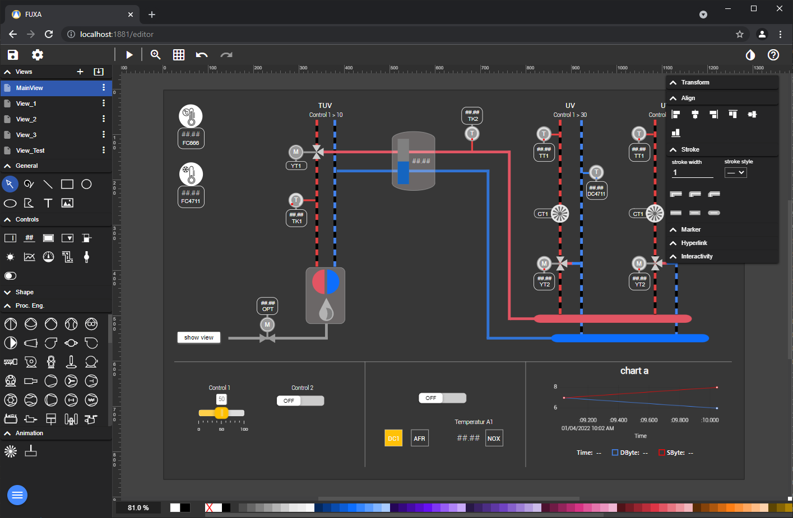
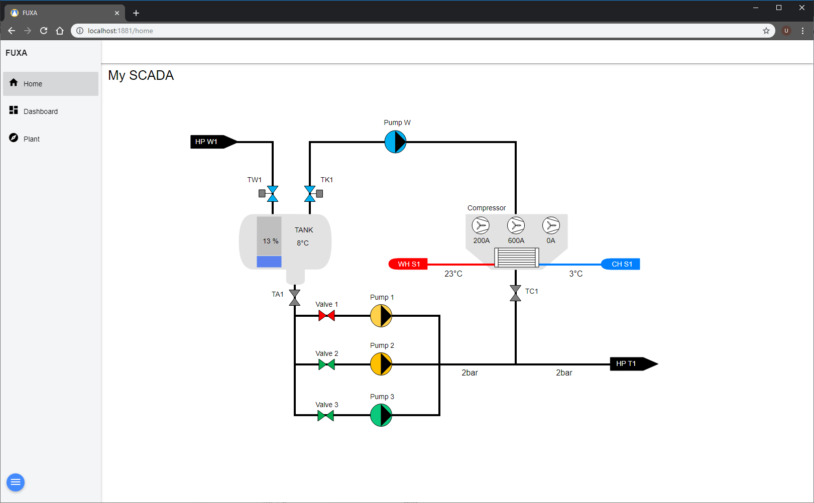

# FUXA 概览

FUXA 是一款功能强大的基于网络的软件，能够快速构建和部署可扩展的 SCADA（监控与数据采集系统）、HMI（人机界面）、仪表板或工业物联网（IIoT）系统。通过FUXA，您可以针对您的机器设计个性化的现代过程可视化界面，实现实时数据显示，并控制自动化工业设备的仪器。

FUXA支持西门子 S7 协议、OPC UA 等常用通信标准，能够连接第三方 OPC 服务器。其支持的通信标准列表可通过开发额外的驱动程序进行扩展。

FUXA 的软件模型基于 Node.js 运行时环境。用户通过网页浏览器访问编辑器，即可创建应用程序（SCADA/HMI/仪表板），同时也可作为客户端运行可视化界面。

## UI

FUXA包含两种不同的视图：FUXA 编辑器用于编辑项目，而 FUXA 视图则用于展示可视化项目的成果。

如下图所示，即为 FUXA 视图。

## 功能特点

FUXA 无需任何运行时授权许可。您可以创建任意数量与规模的人机界面项目，无需担心运行时环境的额外授权问题。

### 通信协议

FUXA平台内置多种连接器，支持直接与西门子PLC及OPC UA数据源通信：

- OPC UA连接客户端

- 西门子S7协议，支持通过以太网与西门子S7-200/300/400/1200/1500系列PLC通信

- 兼容 Modbus RTU/TCP、BACnet IP、MQTT、Ethernet/IP（艾伦-布拉德利）、WebAPI等协议

### 跨平台全栈架构

该系统设计支持多种操作系统，安装便捷。后端基于 NodeJs 开发，用户界面采用可扩展的 HTML5 网页前端，运用 Web 技术（HTML5、CSS、Javascript、Angular、SVG）构建，兼容所有主流现代浏览器。
