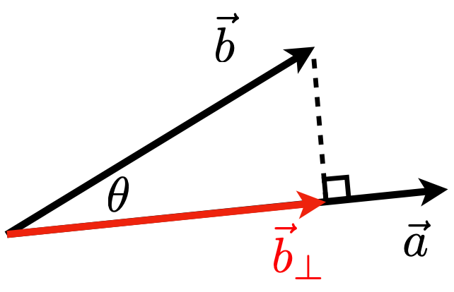
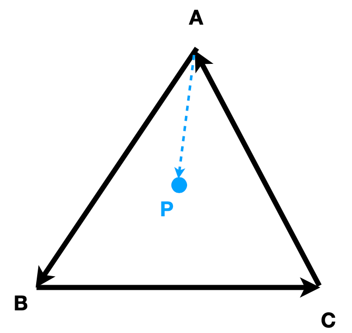

# 线性代数复习

图形学依赖于多种知识。

- 基础数学
  - 线性代数
  - 微积分
  - 统计与概率学
- 基础物理
  - 光学
  - 力学
- 其他
  - 信号处理
  - 数值分析
- 一点美学

## 向量

由 A 点到 B 点的有向线段称为向量 AB，记为：$\overrightarrow{AB}$，若 A 点的坐标为 $(x_a, y_a)$，B 点的坐标为 $(x_b, y_b)$，则 $\overrightarrow{AB}$ 的值为 $\begin{pmatrix} x_b-x_a \\ y_b-y_a \end{pmatrix}$ 。

通常向量写成 $\vec{a}$ 或者用粗体表示 $\mathbf{a}$ 。

向量包含方向和长度，没有指定绝对的起始位置。

## 向量归一化

向量 $\vec{a}$ 的模长记为 $\|\vec{a}\|$ 。

单位向量：

- 模长为 1 的向量称为单位向量；
- 计算一个向量的单位向量称为向量的归一化：$\hat{a} = \vec{a} / \|\vec{a}\|$
- 单位向量常用于表示一个方向

## 向量加法

从图形上看，满足平行四边形法则/三角形法则。

从数值上看，是对应坐标相加。

## 笛卡尔坐标系

向量在笛卡尔坐标系中的表示：$A = \begin{pmatrix}x \\ y \end{pmatrix}$；向量的转置可表示为 $A^T = (x, y)$，向量的模长可表示为 $\|A\| = \sqrt{x^2 + y^2}$

## 向量点乘

向量点乘: $\vec{a}\cdot\vec{b} = \|\vec{a}\|\|\vec{b}\|\cos{\theta}$

向量夹角余弦计算：

$$
\cos\theta = \frac{\vec{a}\cdot\vec{b}}{\|\vec{a}\|\|\vec{b}\|}
$$

对于单位向量的夹角余弦计算：$\cos\theta = \hat{a}\cdot\hat{b}$

点乘符合的运算规则：

- 交换律：$\vec{a}\cdot\vec{b}=\vec{b}\cdot\vec{a}$
- 分配率：$\vec{a}\cdot(\vec{b}+\vec{c})=\vec{a}\cdot\vec{b}+\vec{a}\cdot\vec{c}$
- 结合律：$(k\vec{a})\cdot\vec{b}=\vec{a}\cdot(k\vec{b})=k(\vec{a}\cdot\vec{b})$

笛卡尔坐标系中的向量点乘：各坐标值相乘后取和。

- 二维坐标系中：

$$
\vec{a}\cdot\vec{a} =
\begin{pmatrix}
  x_a \\ y_a
\end{pmatrix}
\cdot
\begin{pmatrix}
  x_b \\ y_b
\end{pmatrix} =
x_{a}x_{b} + y_{a}y_{b}
$$

- 三维坐标系中

$$
\vec{a}\cdot\vec{b} =
\begin{pmatrix}
  x_a \\ y_a \\ z_a
\end{pmatrix}
\cdot
\begin{pmatrix}
  x_b \\ y_b \\ z_b
\end{pmatrix} =
x_ax_b + y_ay_b + z_az_b
$$

## 向量点乘在图形中的作用

- 获取两个向量中的角度（例如：计算光源和物体表面的角度余弦值）
- 计算一个向量在另一个向量上的投影，例如：

$\vec{b_{\perp}}$ : 表示 $\vec{b}$ 在 $\vec{a}$ 方向上的投影。

- $\vec{b_{\perp}}$ 必定与 $\vec{a}$ 的方向相同: $\vec{b_{\perp}} = k\hat{a}$
- $k$ 的值：$k = \|\vec{b_{\perp}}\|=\|\vec{b}\|\cos\theta$

可以判断两个向量所成的角度：

- $\vec{a}\cdot\vec{b} > 0$，表示两个向量成锐角
- $\vec{a}\cdot\vec{b} = 0$ 表示两个向量成直角
- $\vec{a}\cdot\vec{b} < 0$ 表示两个向量成钝角

## 向量叉乘

$$
\vec{c} = \vec{a} \times \vec{b}
$$

两个向量 $\vec{a}$、$\vec{b}$ 叉乘的结果仍然是个向量，且结果 $\vec{c}$ 垂直于由 $\vec{a}$ 与 $\vec{b}$ 确定的平面。

$\vec{c}$ 的方向由右手法则确定。

### 叉乘的数学公式

- $\vec{x}\times\vec{y}=+\vec{z}$
- $\vec{y}\times\vec{x}=-\vec{z}$
- $\vec{y}\times\vec{z}=+\vec{x}$
- $\vec{z}\times\vec{y}=-\vec{x}$
- $\vec{z}\times\vec{x}=+\vec{y}$
- $\vec{x}\times\vec{z}=-\vec{y}$
- $\vec{a}\times\vec{b}=-\vec{b}\times\vec{a}$
- $\vec{a}\times\vec{a}=\vec{0}$
- $\vec{a}\times(\vec{b}+\vec{c})=\vec{a}\times\vec{b}+\vec{a}\times\vec{c}$
- $\vec{a}\times(k\vec{b})=k(\vec{a}\times\vec{b})$

记 $\vec{a} = \begin{pmatrix}
  x_a \\ y_a \\ z_a
\end{pmatrix}$ , $\vec{b} = \begin{pmatrix}
  x_b \\ y_b \\ z_b
\end{pmatrix}$

则 $\vec{a}$ 和 $\vec{b}$ 的叉乘用坐标表示为：

$$
\vec{a}\times\vec{b} = \begin{pmatrix}
  y_az_b - y_bz_a \\
  z_ax_b - x_az_b \\
  x_ay_b - y_ax_b
\end{pmatrix}
$$

也可以表示为：

$$
\vec{a}\times\vec{b}=A^*b=\begin{pmatrix}
  0 & -z_a & y_a \\
  z_a & 0 & -x_a \\
  -y_a & x_a & 0
\end{pmatrix} \begin{pmatrix}
  x_b \\ y_b \\ z_b
\end{pmatrix}
$$

其中 $A^*$ 称为 $\vec{a}$ 的伴随矩阵。

### 叉乘的应用

1. 判断一个向量在另一个向量的左侧还是右侧
   - $\vec{a}\times\vec{b}$ 为正，表示 $\vec{b}$ 在 $\vec{a}$ 的左侧
   - $\vec{a}\times\vec{b}$ 为负，表示 $\vec{b}$ 在 $\vec{a}$ 的右侧
2. 判断一个点在一个图形的内部还是外部，例如：

满足：

- $\overrightarrow{AB}\times\overrightarrow{AP}$ 为 z 轴正向；
- $\overrightarrow{BC}\times\overrightarrow{BP}$ 为 z 轴正向；
- $\overrightarrow{CA}\times\overrightarrow{ CP}$ 为 z 轴正向；

三者同向，因此 P 在三角内部。

### 正交坐标系统

任意的三个向量，满足：

1. $\|\vec{u}\|=\|\vec{v}\|=\|\vec{w}\|=1$，表示这三个向量都是单位向量；
2. $\vec{u}\cdot\vec{v}=\vec{v}\cdot\vec{w}=\vec{u}\cdot\vec{w}=0$，表示向量两两垂直
3. $\vec{w} = \vec{u}\times\vec{v}$

则任一向量 $\vec{p}$ 都可以转换为在这 3 个向量上的投影：

$$
\vec{p}=(\vec{p}\cdot\vec{u})\vec{u}+(\vec{p}\cdot\vec{v})\vec{v}+(\vec{p}\cdot\vec{w})\vec{w}
$$

## 矩阵

在图形学中，矩阵常用于表示**变换**，包括平移、旋转、裁剪、缩放等。

矩阵是一个 $m \times n$ 的数组，m 表示行数，n 表示列数。例如下面的矩阵就是一个 $3 \times 2$ 的矩阵：

$$
\begin{pmatrix}
  1 & 3 \\
  5 & 2 \\
  0 & 4
\end{pmatrix}
$$

### 矩阵乘法

矩阵 A 和矩阵 B 相乘，必须满足 A 的列数等于 B 的行数。例如 A 是 $m \times n$ 的矩阵，B 是 $n \times p$ 的矩阵，则 A 和 B 相乘为 $m \times p$ 的矩阵。例如：

$$
\begin{pmatrix}
  a_{11} & a_{12} \\
  a_{21} & a_{22} \\
  a_{31} & a_{32}
\end{pmatrix}
\begin{pmatrix}
  b_{11} & b_{12} \\
  b_{21} & b_{22}
\end{pmatrix} =
\begin{pmatrix}
a_{11}b_{11}+a_{12}b_{21} & a_{11}b_{12}+a_{12}b_{22}  \\
a_{21}b_{11}+a_{22}b_{21} & a_{21}b_{12}+a_{22}b_{22}  \\
a_{31}b_{11}+a_{32}b_{21} & a_{31}b_{12}+a_{32}b_{22}  \\
\end{pmatrix}
$$

其中新矩阵的第 i 行，第 j 列的值，等于 A 矩阵的第 i 行的元素与 B 矩阵的第 j 列的元素分别相乘后求和的结果。

### 数学法则

- 不满足交换律 $AB \neq BA$
- 满足结合律：$(AB)C = A(BC)$
- 满足分配率
  - $A(B+C)=AB+AC$
  - $(A+B)C=AC+BC$

可以将向量视为只有一列的矩阵(大小为 $m \times 1$)

下面的变换可以视为关于 y 轴对称的变换：

$$
\begin{pmatrix}
  -1 & 0 \\
  0 & 1
\end{pmatrix}
\begin{pmatrix}
  x \\ y
\end{pmatrix} =
\begin{pmatrix}
  -x \\ y
\end{pmatrix}
$$

### 矩阵的转置

交换矩阵行和列的操作称为矩阵的转置，例如：

$$
\begin{pmatrix}
  1 & 2 \\
  3 & 4 \\
  5 & 6
\end{pmatrix} ^ T =
\begin{pmatrix}
  1 & 3 & 5 \\
  2 & 4 & 6
\end{pmatrix}
$$

矩阵转置满足：$(AB)^T=B^TA^T$

### 单位矩阵

对角线都为 1 的矩阵称为单位矩阵，例如：

$$
I_{3 \times 3}=\begin{pmatrix}
  1 & 0 & 0 \\
  0 & 1 & 0 \\
  0 & 0 & 1
\end{pmatrix}
$$

$A^{-1}$ 称为 A 矩阵的逆矩阵，满足：

- $AA^{-1}=A^{-1}A=I$
- $(AB)^{-1}=B^{-1}A^{-1}$

## 向量乘法的矩阵表示形式

- 点乘

$$
\vec{a}\cdot\vec{b} = \vec{a} ^ T \vec{b} =
\begin{pmatrix}
  x_a & y_a & z_a
\end{pmatrix}
\begin{pmatrix}
  x_b \\ y_b \\ z_b
\end{pmatrix} =
\begin{pmatrix}
  x_ax_b + y_ay_b + z_az_b
\end{pmatrix}
$$

- 叉乘

$$
\vec{a}\times\vec{b}=A^{*}\vec{b}=
\begin{pmatrix}
  0 & -z_a & y_a \\
  z_a & 0 & -x_a \\
  -y_a & x_a & 0
\end{pmatrix}
\begin{pmatrix}
  x_b \\ y_b \\ z_b
\end{pmatrix}
$$
